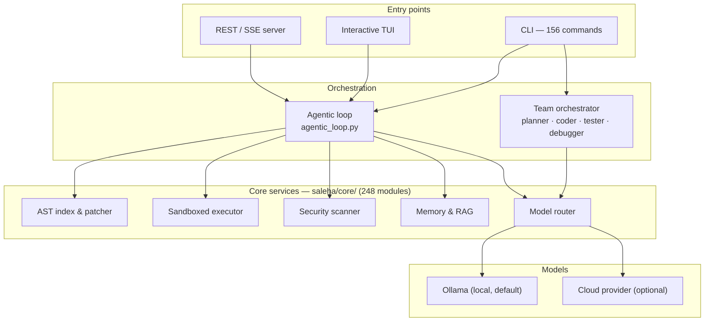
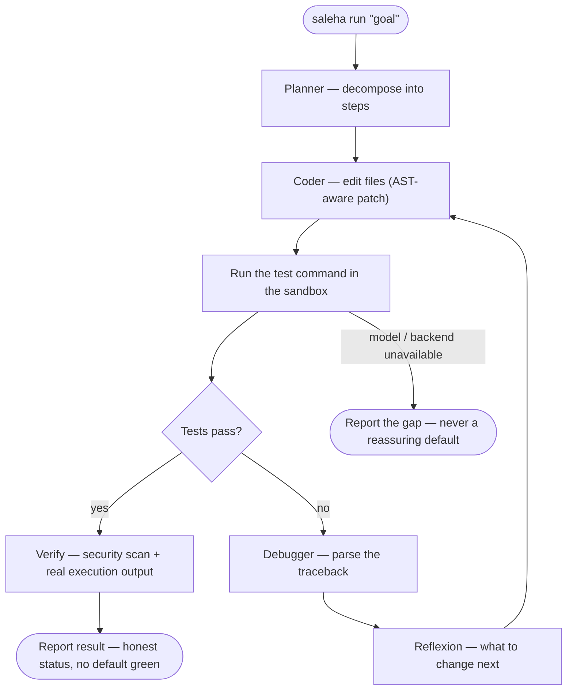
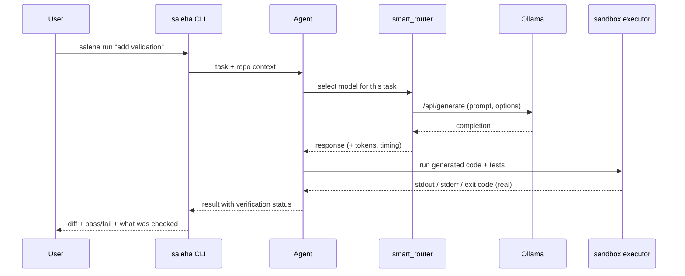

# Saleha


**Saleha** is a local-first, multi-agent AI coding assistant written in Python. It
runs against local models through **Ollama** (or a cloud provider, if you
configure one) and ships a CLI, an interactive TUI, and a REST/SSE web server.

It is a large, actively evolving codebase — **248 modules under `saleha/core/`**,
a Click-based CLI with **156 registered subcommands**, and **1,714 passing tests**
(7 opt-in skips). Not every module is equally mature. **This README describes what
is real and working today**; speculative and future work lives in
[ROADMAP.md](ROADMAP.md), and how the pieces fit is in
[ARCHITECTURE.md](ARCHITECTURE.md).

---

## Table of contents

- [What's actually here](#whats-actually-here)
- [Architecture at a glance](#architecture-at-a-glance)
- [How the agentic loop works](#how-the-agentic-loop-works)
- [Request path](#request-path-cli--agent--model)
- [On the swarm / consensus language](#on-the-swarm--consensus-language)
- [Quickstart](#quickstart)
- [CLI command reference](#cli-command-reference-selected)
- [Client apps](#client-apps)
- [Tests](#tests)
- [Project honesty](#project-honesty)
- [License](#license)

---

## What's actually here

Every entry maps to real code and real tests. Paths are given so you can verify
them.

| Capability | What it does | Where |
| :--- | :--- | :--- |
| **Agentic coding loop** | Plans a task, edits files, runs the test command, iterates on failures — a real ReAct-style loop, not one prompt. | `saleha/core/agentic_loop.py` · `saleha run` |
| **Multi-agent roles** | `PlannerAgent`, `CoderAgent`, `TesterAgent`, `DebuggerAgent`, orchestrated for multi-step / multi-role tasks. | `saleha/agents/` · `saleha team` |
| **AST indexing & patching** | Symbol scanning and unified-diff patch generation; edits are parse-checked, not string-spliced. | `saleha/core/codebase_indexer.py` · `saleha scan` |
| **Sandboxed execution** | Generated / untrusted code runs in a subprocess or Docker container with resource limits and an audit log. | `saleha/core/code_executor.py` · `saleha exec` |
| **Static security scanning** | AST-based SAST: `shell=True`, bare `except`, hardcoded secrets, SQL string formatting, and more. Some Verilog/SystemVerilog support. | `saleha/core/security_scanner.py` · `saleha sast` |
| **Retrieval & memory** | A persistent solution-memory store, a lightweight RAG / graph-memory layer, and fast local code search. | `saleha/core/memory_store.py` · `graph_rag.py` |
| **Model routing** | Routes requests across configured local (Ollama) and remote backends, with a runtime-probing smart router. | `saleha/core/model_provider.py` · `smart_router.py` |
| **Project scaffolder** | `saleha new fastapi\|express\|go <name>` copies a starter service from a template and verifies it builds — deterministic, no model call. | `saleha/core/project_scaffolder.py` · `saleha new` |
| **Headless browser checks** | DOM / console inspection of a page via a headless browser driver, when one is installed. | `saleha/core/browser_agent.py` · `saleha browser` |
| **Souls persona system** | Ten JSON-configured personas (temperature, allowed tools) plus a prompt bundle rendered into the agent's system prompt. A real prompt layer — not a claim about model cognition. | `souls/` · `saleha/core/soul_engine.py` |
| **Web server** | A dependency-light HTTP/SSE server exposing much of the above over a REST API, with a browser UI. | `saleha/server/web_server.py` · `saleha serve` |

The ten personas: `architect`, `artisan`, `auditor`, `sage`, `sentinel`,
`sovereign`, `speedrunner`, `sre`, `alchemist`, `minimalist`.

---

## Architecture at a glance



---

## How the agentic loop works

`saleha run "<goal>"` is a plan → act → observe cycle. Each iteration edits files,
runs the project's own test command, and feeds failures back in — it does not
stop at "looks done".



Two rules the loop enforces, learned from this project's own audit history:

- **A step that cannot run says so.** No component returns a reassuring default
  when it did not actually do the work.
- **The verifier is real.** "Tests passed" comes from executing the generated
  code and its tests, not from a hardcoded flag.

---

## Request path (CLI → agent → model)



---

## On the swarm / consensus language

Earlier versions of this document described some modules as "PBFT Byzantine Fault
Tolerant consensus," "Lean 4 formal proofs," and a "16-dimensional Poincaré
hyperbolic swarm topology." To be precise about what exists in code today:

- **`swarm_consensus.py`** implements a three-phase (propose / prepare / commit)
  voting protocol among named agent roles **inside a single process**. The
  structure is modeled on that family of protocols, but it does not run across
  machines, does not tolerate crashes or partitions, and has not been verified
  against Byzantine fault-tolerance guarantees. Read it as *structured agent
  voting*, not a distributed consensus protocol.
- **`formal_verifier.py` / `formal_smt_verifier.py`** generate Lean4- and
  SMT-shaped text as templates. They do not invoke the Lean toolchain or shell
  out to Z3 — scaffolding for a feature that is not implemented.
- **`hyperbolic_engine.py`** implements real 16-dimensional Poincaré-ball vector
  math (distance, attractor basins) used as a deterministic task-routing
  heuristic — not emergent swarm cognition.

None of this is disqualifying — it is honest scaffolding a contributor can build
on. It just is not what the previous marketing copy claimed.

---

## Quickstart

```bash
# 1. Install
git clone https://github.com/MDaftab76678-1945/Saleha.git
cd Saleha
pip install -e .            # add ".[dev]" for the test extras

# 2. Connect a local model
ollama run qwen2.5-coder:7b

# 3. Use it
saleha tui                                   # interactive TUI
saleha run "add input validation to login"   # one-shot autonomous task
saleha new fastapi orders-api                # scaffold a starter service
```

Requires Python **3.12+**. Most tests and commands need neither Ollama nor Docker;
the agentic loop needs a reachable model.

---

## CLI command reference (selected)

The CLI exposes 156 registered subcommands; run `saleha --help` for the full,
current list. Core workflow commands:

| Command | Description |
| :--- | :--- |
| `saleha run "<goal>"` | Autonomous plan → edit → test loop for a task. |
| `saleha agent "<goal>"` | Single-agent task execution with optional write access. |
| `saleha team "<goal>"` | Multi-role (planner / coder / tester / debugger) orchestration. |
| `saleha plan "<goal>"` | Produces a plan without executing it. |
| `saleha code "<task>"` | Generates code for a described task. |
| `saleha ask "<question>"` | One-shot question answering, no shell session. |
| `saleha new <stack> <name>` | Scaffold a runnable starter service (`fastapi`, `express`, `go`). |
| `saleha scan <dir>` | AST-based codebase symbol indexing. |
| `saleha refactor <file> "<instruction>"` | Targeted AST-aware refactor with diff output. |
| `saleha exec <file>` / `saleha sandbox <file>` | Execute a file with resource limits / in an isolated sandbox. |
| `saleha sast <path>` | Static security scan (Python; some Verilog/SystemVerilog). |
| `saleha test <file>` / `saleha debug <file>` | Generate / repair tests for a file. |
| `saleha browser <url>` | Headless-browser DOM / console inspection. |
| `saleha rag "<question>"` | Retrieval-augmented question answering over the repo. |
| `saleha consensus` | Inspect the in-process voting module's validator / proposal state. |
| `saleha constitutional-check <path>` | Rule-based `constitutional_guard` code audit. |
| `saleha merkle-audit` / `saleha merkle-leaves` | Verify / list the audit log's hash chain. |
| `saleha soul list` / `saleha soul use <name>` | List and activate a persona from `souls/`. |
| `saleha serve` / `saleha sidecar` | Start the local REST/SSE web server. |
| `saleha status` / `saleha doctor` | Environment and dependency diagnostics. |

---

## Client apps

- **`apps/web`** — a Next.js app that calls the Python backend over HTTP
  (`fetch("http://127.0.0.1:8000/...")`) for code execution and agent endpoints.
  Real and working.
- **`apps/desktop`** — a Tauri app that launches the Python backend as a bundled
  sidecar and talks to it over the same HTTP API. Newer / less battle-tested than
  the CLI.
- **`rust/`** and **`contracts/`** — experimental Rust crates (zkVM / blockchain
  research) and Solidity contracts. Standalone today, not integrated into the
  Python agent runtime.

---

## Tests

```bash
python -m pytest saleha/tests/ -q       # set PYTHONIOENCODING=utf-8 on cp1252 consoles
```

The suite covers the CLI, core modules, the web-server API, and integration
points. A full local run (no Ollama / Docker needed for the default set):

```text
1714 passed, 7 skipped, 60 subtests passed in ~90s
```

The 7 skips are all genuinely opt-in — real GPU fine-tuning runs, a multi-minute
live-model debate, an `npm install` — each gated behind an env flag
(`SALEHA_RUN_GPU_TESTS`, `SALEHA_LIVE_MODEL_TESTS`, `SALEHA_RUN_SLOW_TESTS`) and
verified to pass when enabled. `saleha/tests/conftest.py` sets
`SALEHA_TEST_MODE=1` for the run so nothing reaches a real model by accident.
Results vary slightly by environment; run the suite locally for current status.

---

## Project honesty

A large part of this project's recent history is an audit: finding places where a
component claimed work it had not done — a hardcoded "tests passed", a benchmark
scoreboard with invented numbers, an orchestrator that reported success without
calling a model — and replacing the fabricated half with something measured.
**Thirty-five passes of that are recorded in
[NOTEBOOK_IMPORT.md](NOTEBOOK_IMPORT.md)**, each finding paired with the probe
that proved it.

The one measured performance number for the agent itself, on twelve real
programming tasks (each with a test suite verified to fail on wrong code first):

| model | pass | time |
| :--- | :--- | :--- |
| `deepseek-coder:6.7b` | 11 / 12 | 368s |
| `qwen2.5-coder:3b` | 10 / 12 | 115s |

This is **not SWE-bench and not a leaderboard** — it is a local measurement on one
machine (`scripts/measure_real_pass_rate.py`). An earlier version of it was itself
wrong (the harness was executing the model's own test code); the number above is
post-fix.

---

## License

MIT License.
