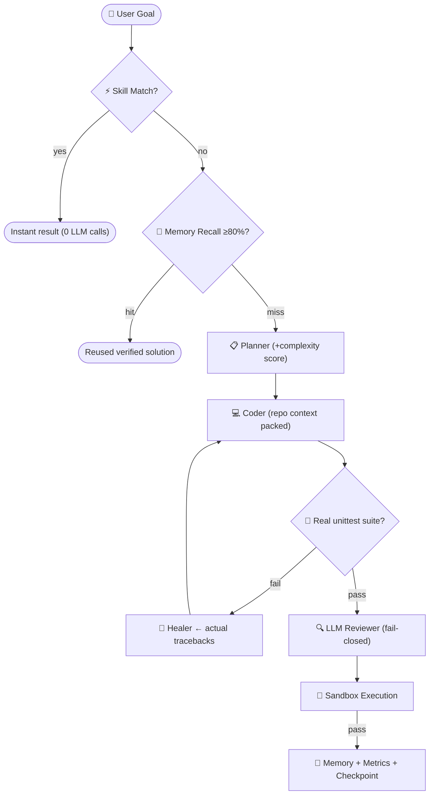

# 🧠 Saleha AI Framework

[-brightgreen.svg)]()
[]()
[]()
[]()

**Saleha** is a local-first, self-healing **Autonomous Multi-Agent AI Engineering Platform** powered by Ollama. Five specialized agents (Product Manager → Software Designer → Senior SDE → Security Engineer → QA Architect) collaborate through parallel task DAGs, run **real sandboxed test-verification loops**, perform AST-based SAST security audits, expose a dual MCP engine, and ship with a ReAct-style autonomous agent loop with surgical Aider-style diffing — **100% local, $0 API cost**.

---

## ⚡ Why Saleha

| Capability | Detail |
|---|---|
| 🧠 **DeepSeek-R1 CoT Reasoning** | Extracts and streams `<think>...</think>` internal model reasoning tokens without JSON corruption |
| ✂️ **Surgical Aider-Style Diffing** | `<<<<<<< SEARCH ... ======= ... >>>>>>>` block diffs with 3-tier fuzzy indentation-tolerant search (90% token reduction) |
| 🌲 **Git Worktree Isolation** | Swarm agents run in parallel ephemeral Git worktree branches (`saleha/task-...`) keeping the main workspace pristine |
| 🌐 **GraphRAG & Blast Radius** | AST symbol call hierarchy traces + downstream impacted files analysis before applying code changes |
| 🔒 **Enforced Sandboxing** | Generated code runs via Docker (`--network none`, CPU/mem caps) or hardened polyglot subprocess blocklist (Python, JS, TS, Go, Java, Rust) |
| 🤖 **Autonomous Agent Loop (ReAct)** | `saleha agent "goal"` — model thinks, calls tools (`read_file`, `find_symbols`, `get_file_outline`, `patch_file`, `run_code`), iterates until done |
| ✏️ **Multi-File Editor** | `saleha edit "goal" --dir ./repo --apply` — structured JSON plans, unified diff previews, atomic apply + rollback |
| 🧪 **Real Test-Driven Healing** | `--tests` generates a unittest suite; the self-healing loop runs it in the sandbox and fixes real failures (not just syntax checks) |
| ⚡ **Speculative Fast Tier Router** | Sub-5ms task tier classifier cascading simple tasks to instant 1.5B/4B models and complex tasks to 8B/30B reasoning models |
| 👁️ **Real Vision** | `saleha vision "spec" --image mockup.png` — screenshot → working UI code via local llava/qwen-vl |
| 📦 **Repository Context Packer** | Aider-style task-relevant repo map (tree + AST symbol outlines + key excerpts) packed into coder prompts |
| 🌐 **MCP Dual Engine** | JSON-RPC 2.0 stdio server/client exposing swarm/DAG/SAST/sandbox/memory tools |

---

## 🚀 Quickstart

### 1. Prerequisites
Install [Ollama](https://ollama.ai/) and pull a coding model:
```powershell
ollama pull qwen2.5-coder:1.5b   # fast tier
# optional flagship:
ollama pull qwen3-coder:30b
```

### 2. Install Saleha
```powershell
git clone https://github.com/MDaftab76678-1945/Saleha.git
cd Saleha
py -3.12 -m pip install -r requirements.txt
py -3.12 -m pip install -e .
saleha --version
```

### 3. First Run
```powershell
saleha run "Create a function that checks if a number is prime"
saleha run "Build a token bucket rate limiter" --tests          # real unittest healing
saleha agent "find functions without docstrings" --dir ./src    # autonomous exploration
```

---

## 🛠️ Command Reference

### Core Pipelines
| Command | What it does |
|---|---|
| `saleha run "GOAL"` | Full self-healing pipeline: Plan → Code → Test → Review → Execute |
| `saleha run "GOAL" --tests` | + generate unittest suite, heal on REAL test failures |
| `saleha run "GOAL" --context-dir ./src` | + pack task-relevant repo context into prompt |
| `saleha run "GOAL" --stream` | live token streaming |
| `saleha run --resume` | continue last interrupted run from checkpoint |
| `saleha team "GOAL"` | 5-agent swarm: PM → Designer → SDE → Security Gate → QA (+`--debate`) |
| `saleha dag "GOAL" --parallel` | dependency-DAG execution on thread pool |
| `saleha agent "GOAL" --dir .` | autonomous ReAct loop with tools (`--write` opt-in) |
| `saleha edit "GOAL" --dir ./repo --apply` | multi-file edits: dry-run diffs → atomic apply |

### Introspection & Ops
```powershell
saleha metrics                 # success-rate, avg attempts, per-model stats
saleha doctor                  # system health checks
saleha status                  # Ollama probe + installed models
saleha memory search "jwt"     # semantic solution recall (--semantic)
saleha agents                  # 20 dynamically-loaded profiles
```

### Security & Quality
```powershell
saleha sast ./src              # AST SAST scan (SQLi, eval, secrets, shell=True)
saleha ci review .             # autonomous PR review bot (CI-friendly exit codes)
saleha fuzz process            # mutation fuzzer
saleha vault set db_pass x     # encrypted secret store
```

### Interactive & Web
```powershell
saleha chat                    # streaming pair-programming REPL (/profile, /exec, ...)
saleha serve                   # Web Studio + REST API (token-authenticated)
saleha dashboard               # live terminal dashboard
```

---

## ⚙️ Environment Variables

| Variable | Default | Purpose |
|---|---|---|
| `SALEHA_SANDBOX` | `auto` | `auto`\|`local`\|`docker`\|`require-docker` (strict fail-closed) |
| `SALEHA_DOCKER_IMAGE` | `python:3.12-slim` | Sandbox container image |
| `SALEHA_DOCKER_AUTO_PULL` | `1` | Auto-pull missing sandbox image |
| `SALEHA_APPROVAL` | `off` | HITL gates: `off`\|`dangerous`\|`always` |
| `SALEHA_STUDIO_TOKEN` | auto-generated | Web Studio API token |
| `SALEHA_EMBED_MODEL` | `nomic-embed-text` | Ollama embedding model for semantic memory |
| `SALEHA_REVIEW_OFFLINE_PASS` | unset | `1` = approve code when LLM review unavailable (legacy) |
| `GROQ_API_KEY` etc. | — | Cloud fallback keys (Groq/OpenAI/Anthropic/Gemini/OpenRouter) |

---

## 🏗️ Architecture



## 🐳 Sandbox Execution Modes

```powershell
$env:SALEHA_SANDBOX = "require-docker"   # production-recommended: fail-closed containers
$env:SALEHA_DOCKER_IMAGE = "python:3.12-slim"
```
Docker mode isolates every generated-code run: no network, memory/CPU caps, pids-limit, no-new-privileges.

---

## 🧪 Test Suite

```powershell
py -3.12 -m unittest discover -s saleha/tests -v
```
```text
Ran 327 tests ... OK
```
LLM layer fully mocked — suite runs offline, deterministically, in ~30s.

## 📄 License
MIT
