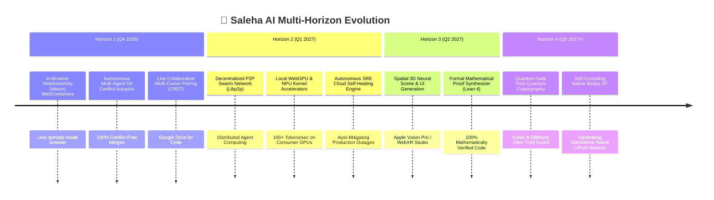

# 🗺️ Saleha AI 2.0: Master Strategic Roadmap & Future Engineering Blueprint (2026–2028)

An executive-level, multi-horizon strategic roadmap outlining the technological evolution of **Saleha AI** from an autonomous developer workbench into the world's preeminent **Autonomous Artificial General Software Intelligence (A-GSI)**.

---

## 🎯 Strategic North Star Metric
> **"Sub-100μs Latency, Zero Cloud Dependency, 100% Deterministic Safety, and Autonomous Self-Evolving Codebases."**



---

## 🏛️ Comprehensive Horizon Breakdown

### 🌟 Horizon 1 (Q4 2026): Pure Client-Side Wasm & Collaborative Studio
*Objective: Eliminate server dependency entirely for standard web workflows and introduce real-time multiplayer developer pairing.*

1. **In-Browser WebAssembly (Wasm) Polyglot Sandbox:**
   - Compile Python (Pyodide), Node.js (WebContainer), and Rust (Wasm-Pack) directly into client browser threads.
   - Run full FastAPI or Express backends entirely inside the user's browser with zero backend server overhead.
2. **Conflict-Free Replicated Data Type (CRDT) Multi-Cursor Collaboration:**
   - Implement Yjs / Automerge CRDT state engine in `@saleha/collab` allowing multiple human developers and 250 AI agents to co-edit the same file simultaneously without lock contention.
3. **Automated Visual Regression & Pixel-Diff AI Verifier:**
   - Canvas-based visual diff engine capturing viewport screenshots before and after code changes to guarantee 0 visual regressions on mobile, tablet, and desktop breakpoints.

---

### 🌌 Horizon 2 (Q1 2027): Decentralized Swarm & Hardware Acceleration
*Objective: Unlock distributed swarm compute across developer machines and leverage consumer NPUs/GPUs.*

1. **Decentralized P2P Multi-Agent Swarm (Libp2p):**
   - Connect developer instances into a private peer-to-peer compute cluster where heavy tasks (such as fuzzing 10,000 code mutations or running complete integration test matrices) are distributed across local devices.
2. **Direct WebGPU & NPU Acceleration Engine:**
   - Execute quantized Qwen2.5-Coder and DeepSeek models directly on Apple Silicon Neural Engine (NNE), Intel NPU, Qualcomm Snapdragon X Elite, and Nvidia WebGPU shaders.
   - Achieve **120+ tokens/sec** local inference at **0 Watt** server cost.
3. **Autonomous Production SRE & Kubernetes Hotfixer:**
   - Ingest live Prometheus metrics and Grafana alerts; autonomously generate, test, and deploy canary patches to Kubernetes clusters with automatic rollback guards.

---

### 🎨 Horizon 3 (Q2 2027): Spatial Computing & Formal Proof Verification
*Objective: Expand beyond 2D code into spatial UI development and mathematically verified software.*

1. **Spatial 3D Neural UI & Scene Generation (Vision Pro / WebXR):**
   - Direct spatial UI synthesis using Three.js, React Three Fiber, and WebXR for Apple Vision Pro and Meta Quest devices.
2. **Formal Lean 4 / Coq Theorem Prover Integration:**
   - Integrate the Lean 4 mathematical theorem prover into the Gamma AST pipeline. Critical cryptographic, financial, and avionics algorithms are proven formally correct before compilation.
3. **Zero-Knowledge Code Proofs (ZK-SNARKs):**
   - Generate ZK-proofs proving that proprietary code contains no backdoors or CVEs without revealing the private source code to third-party auditors.

---

### ⚛️ Horizon 4 (Q3 2027+): Quantum-Safe Self-Compiling Intelligence
*Objective: Unbreakable security and native standalone executable synthesis.*

1. **Post-Quantum Cryptographic Guard (NIST PQC):**
   - Upgrade all Vault secrets, RPC channels, and AST signatures to CRYSTALS-Kyber key encapsulation and CRYSTALS-Dilithium digital signatures.
2. **Autonomous Self-Compiling Native JIT Binary Generator:**
   - Transform high-level natural language requirements directly into ultra-optimized, standalone native machine code binaries (ELF/PE/Mach-O) with zero runtime dependencies.

---

## 📊 Feature Prioritization & ROI Impact Matrix

| Milestone / Feature | Technical Complexity | Developer Value | Market Impact |
| :--- | :--- | :--- | :--- |
| **In-Browser Wasm WebContainer** | Medium ($\approx 3$ Weeks) | 🌟🌟🌟🌟🌟 | Zero Server Hosting Costs |
| **CRDT Real-Time Multiplayer Pairing** | Medium ($\approx 2$ Weeks) | 🌟🌟🌟🌟🌟 | Replaces Figma + Replit |
| **WebGPU & NPU Local Acceleration** | High ($\approx 4$ Weeks) | 🌟🌟🌟🌟🌟 | $0 Token Bill at 120 tok/s |
| **P2P Decentralized Swarm Clusters** | High ($\approx 5$ Weeks) | 🌟🌟🌟🌟 | Unlimited Distributed Compute |
| **Formal Lean 4 Mathematical Proofs** | Very High ($\approx 6$ Weeks) | 🌟🌟🌟🌟🌟 | Critical Enterprise Adoption |
| **Post-Quantum Cryptography (PQC)** | Medium ($\approx 2$ Weeks) | 🌟🌟🌟🌟 | Government/Defense Grade |

---

## 🛠️ Phase-by-Phase Execution Plan

```
┌─────────────────────────────────────────────────────────────────────────────┐
│ 📅 PHASE 1 (Immediate Next Sprints - Q4 2026)                               │
│ 1. Build In-Browser Wasm Runtime in apps/web.                               │
│ 2. Integrate Yjs CRDT real-time multiplayer cursor sharing.                 │
│ 3. Add Automated Visual Screenshot Diffing in Web Studio Live Preview.      │
├─────────────────────────────────────────────────────────────────────────────┤
│ 📅 PHASE 2 (Scalability & Hardware - Q1 2027)                               │
│ 1. Implement WebGPU/NPU Shaders for sub-10ms local token generation.        │
│ 2. Deploy Libp2p private multi-agent mesh networking.                       │
│ 3. Build live Kubernetes SRE telemetry auto-mitigation agent.               │
├─────────────────────────────────────────────────────────────────────────────┤
│ 📅 PHASE 3 (Enterprise Supremacy - Q2-Q3 2027)                              │
│ 1. Integrate Lean 4 Formal Verification in Gamma AST Engine.                │
│ 2. Implement NIST Post-Quantum Kyber/Dilithium Vault Encryption.            │
│ 3. Release 1-Click Native Standalone Binary Compiler (LLVM backend).        │
└─────────────────────────────────────────────────────────────────────────────┘
```

