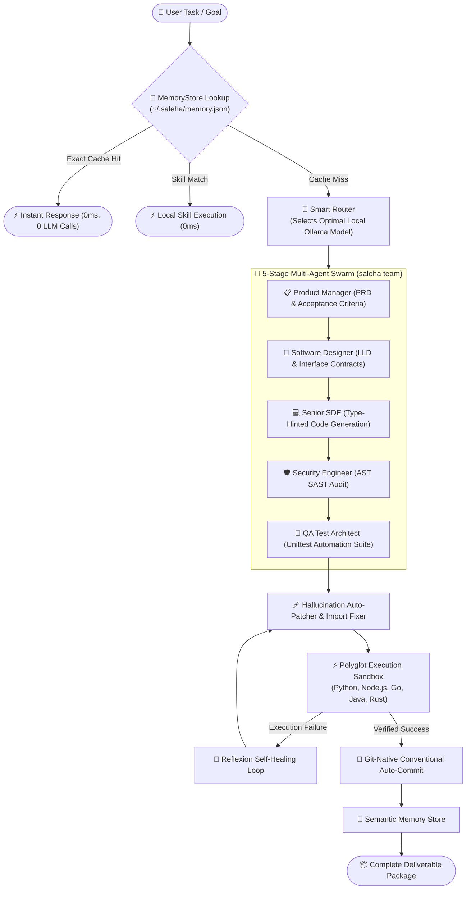

# 📐 Saleha AI — Architectural Blueprint & System Design

**Saleha** is a local-first, self-healing Autonomous Multi-Agent AI Software Engineering Platform designed to deliver enterprise software packages with 100% data privacy, zero API costs, and built-in security guardrails.

---

## 1. High-Level System Architecture

---

## 2. Core Subsystems

### 2.1 Multi-Agent Orchestration Engine (`saleha.core.team_orchestrator`)
- **Stage 1: Product Manager (`agent_product_manager`)**: Formulates comprehensive Product Requirement Documents (PRD), user personas, and acceptance criteria.
- **Stage 2: Software Designer (`agent_software_designer`)**: Designs low-level class models, data schemas, and domain boundaries.
- **Stage 3: Senior SDE (`agent_sde`)**: Produces production-ready, typed implementation code.
- **Stage 4: Security Engineer (`agent_security_engineer`)**: Conducts threat modeling and AST vulnerability scans.
- **Stage 5: Test Architect (`agent_test_automation_engineer`)**: Generates automated unittest test suites.
- **Deliberation Engine**: When `--debate` is enabled, the Architect and Security Engineer engage in structured peer critique to reach consensus.

### 2.2 Parallel Task DAG Engine (`saleha.core.dag_engine`)
- Constructs Directed Acyclic Graphs of independent development tasks.
- Resolves dependencies via topological sort.
- Executes independent batches concurrently using `ThreadPoolExecutor`.

### 2.3 Polyglot Sandbox Execution Engine (`saleha.core.polyglot_executor`)
- Executes Python, JavaScript/Node.js, TypeScript, Go, Java, and Rust in temporary isolated directories.
- Enforces pre-execution AST SAST security validation to prevent arbitrary execution, leaks, or command injection.
- Caps output streams at 50KB to protect system resources.

### 2.4 Encrypted Secret & Knowledge Vault (`saleha.core.vault`)
- Encrypts credentials with PBKDF2-HMAC-SHA256 (100,000 iterations).
- Manages API keys, database credentials, and secret environment variables without plaintext disk leakage.

### 2.5 Dual Model Context Protocol (MCP) Engine (`saleha.core.mcp_engine`)
- **MCP Server**: Exposes core Saleha tools (file search, AST scan, code execution, git commit) to external AI agents via stdio and HTTP/SSE.
- **MCP Client**: Connects Saleha agents to third-party MCP servers (databases, browser agents, GitHub APIs).

