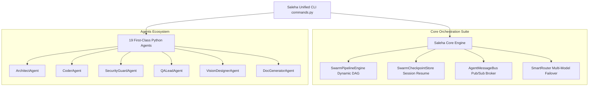

# 🏛️ saleha-0.1 Codebase Architecture & Technical Reference

Autonomously generated by **Saleha AI v2.6.0 DocGeneratorAgent**.

---

## 📊 Repository Metrics
- **Total Scanned Python Modules**: `459`
- **Total Classes Defined**: `834`
- **Total Public Functions**: `2185`

---

## 📐 System Architecture Diagram

---

## 📚 Key Module API Reference
### 📄 `setup.py`
- **Classes**: None
- **Functions**: None

### 📄 `examples\run_dogfood_demo.py`
- **Classes**: None
- **Functions**: `main()`

### 📄 `saleha\main.py`
- **Classes**: None
- **Functions**: None

### 📄 `saleha\orchestrator.py`
- **Classes**: `OrchestrationResult`, `SalehaOrchestrator`
- **Functions**: `execute_task()`, `execute_with_tot_exploration()`

### 📄 `saleha\__init__.py`
- **Classes**: None
- **Functions**: None

### 📄 `scripts\build_distribution.py`
- **Classes**: None
- **Functions**: `build_package()`

### 📄 `scripts\build_release.py`
- **Classes**: None
- **Functions**: `build_release()`

### 📄 `scripts\build_standalone.py`
- **Classes**: None
- **Functions**: `build_binary()`

### 📄 `scripts\ci_test_runner.py`
- **Classes**: None
- **Functions**: `main()`

### 📄 `scripts\gen_cli_docs.py`
- **Classes**: None
- **Functions**: `format_params()`, `describe()`, `render_group()`, `main()`

---
*Generated in `796.35ms` by Saleha AI Documentation Engine.*
