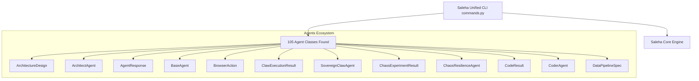

# saleha-0.1 Codebase Architecture & Technical Reference

Autonomously generated by Saleha's DocGeneratorAgent.

---

## Repository Metrics
- **Total Scanned Python Modules**: `975`
- **Total Classes Defined**: `2014`
- **Total Public Functions**: `5766`

---

## System Architecture Diagram

---

## Key Module API Reference
### `datasets\synthesize_asi_math_reasoning_data.py`
- **Classes**: None
- **Functions**: `generate_asi_dataset()`

### `datasets\synthesize_dsa_livecodebench_data.py`
- **Classes**: None
- **Functions**: `clean_prompt_merging()`, `generate_dsa_dataset()`

### `datasets\synthesize_hardcore_data.py`
- **Classes**: None
- **Functions**: `generate_hardcore_dataset()`

### `datasets\synthesize_omni_leaderboard_data.py`
- **Classes**: None
- **Functions**: `generate_omni_leaderboard_dataset()`

### `datasets\synthesize_sovereign_ultra_dataset.py`
- **Classes**: None
- **Functions**: `generate_tool_samples()`, `generate_hindi_persona_samples()`, `generate_debugging_samples()`, `main()`

### `datasets\synthesize_tourist_gemini_dataset.py`
- **Classes**: None
- **Functions**: `main()`

### `datasets\_synth_guard.py`
- **Classes**: None
- **Functions**: `guard_output_path()`

### `examples\run_dogfood_demo.py`
- **Classes**: None
- **Functions**: `main()`

### `saleha\main.py`
- **Classes**: None
- **Functions**: None

### `saleha\orchestrator.py`
- **Classes**: `OrchestrationResult`, `SalehaOrchestrator`
- **Functions**: `execute_task()`, `execute_with_tot_exploration()`

---
*Generated in `4922.06ms` by Saleha AI Documentation Engine.*
