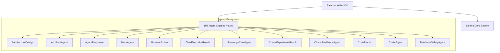

# saleha-0.1 Codebase Architecture & Technical Reference

Autonomously generated by Saleha's DocGeneratorAgent.

---

## Repository Metrics
- **Total Scanned Python Modules**: `1428`
- **Total Classes Defined**: `2292`
- **Total Public Functions**: `7108`

---

## System Architecture Diagram

```mermaid
graph TD
    CLI[Saleha Unified CLI] --> Core[Saleha Core Engine]
    CLI --> Agents[108 Agent Classes Found]

    subgraph "Agents Ecosystem"
        Agents --> ArchitectureDesign["ArchitectureDesign"]
        Agents --> ArchitectAgent["ArchitectAgent"]
        Agents --> AgentResponse["AgentResponse"]
        Agents --> BaseAgent["BaseAgent"]
        Agents --> BrowserAction["BrowserAction"]
        Agents --> ClawExecutionResult["ClawExecutionResult"]
        Agents --> SovereignClawAgent["SovereignClawAgent"]
        Agents --> ChaosExperimentResult["ChaosExperimentResult"]
        Agents --> ChaosResilienceAgent["ChaosResilienceAgent"]
        Agents --> CodeResult["CodeResult"]
        Agents --> CoderAgent["CoderAgent"]
        Agents --> DatabaseSafetyAgent["DatabaseSafetyAgent"]
    end
```

---

## Key Module API Reference
### `examples\run_dogfood_demo.py`
- **Classes**: None
- **Functions**: `main()`

### `saleha\main.py`
- **Classes**: None
- **Functions**: None

### `saleha\orchestrator.py`
- **Classes**: `OrchestrationResult`, `SalehaOrchestrator`
- **Functions**: `tests_passed()`, `execute_task()`, `execute_with_tot_exploration()`, `run()`, `ask()`

### `saleha\__init__.py`
- **Classes**: None
- **Functions**: None

### `scratch\annotate_test_types.py`
- **Classes**: None
- **Functions**: `add_none_return()`

### `scratch\append_pass143.py`
- **Classes**: None
- **Functions**: `main()`

### `scratch\append_pass144.py`
- **Classes**: None
- **Functions**: None

### `scratch\append_pass144_ledger.py`
- **Classes**: None
- **Functions**: None

### `scratch\append_passes.py`
- **Classes**: None
- **Functions**: `main()`

### `scripts\agent_bench.py`
- **Classes**: None
- **Functions**: `prepare()`, `verify()`, `agent_command()`, `final_answer()`, `claimed()`

---
*Generated in `19437.37ms` by Saleha AI Documentation Engine.*
