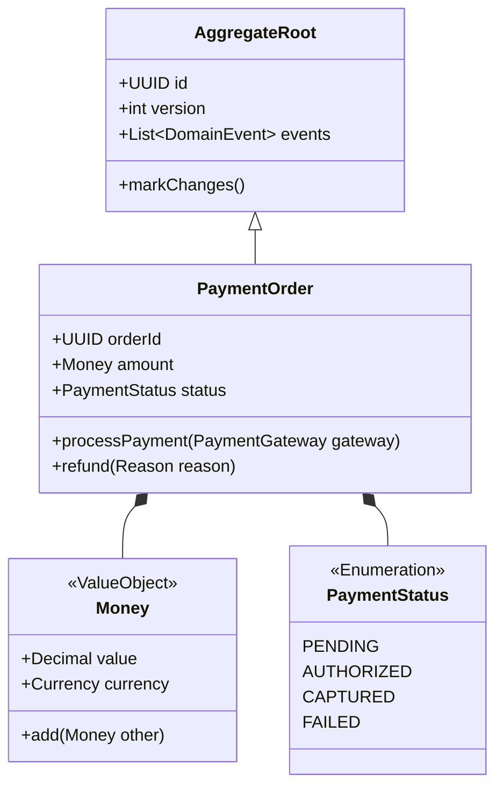

# Software Designer Specification

## 1. Low-Level Design (LLD) Blueprint Framework
```text
[Client Layer] ──> [API Gateway / Controller Tier]
                         │ (DTO Translation)
                         ▼
             [Application Service Tier] (Use-case Orchestration)
                         │
             ┌───────────┴───────────┐
             ▼                       ▼
      [Domain Entities]       [Domain Services]
     (Pure Business Logic)   (Cross-Entity Rules)
             │                       │
             └───────────┬───────────┘
                         ▼
             [Repository Interfaces] (Port)
                         │
                         ▼
         [Infrastructure Adapters] (Postgres/Redis/Kafka)
```

## 2. Domain Modeling (Mermaid UML)


